# Setup Postman Monitoring

Monitors will run in Postman Cloud and send you emails if the tests fail.

**Type**: Group work

---

## Limitations

Free tier only allows for 1000 requests per month. That means that you can only run 1 HTTP request hourly. 

See your monitoring usage here: https://web.postman.co/billing/add-ons/overview

And see the running monitors and amount of request used here: https://web.postman.co/usage/monitors

---

## Create collection

You must create a collection in Postman first. A collection is a group of requests.

https://learning.postman.com/docs/getting-started/first-steps/creating-the-first-collection/

You can also import your OpenAPI spec file to get all the requests. Remember to only set up a monitor for 1 request because of the limitation discussed above. 


---

## Set variables

Highlight parts of the URL and right click to get the context menu. Choose `Set as variable`, give it a name and scope.

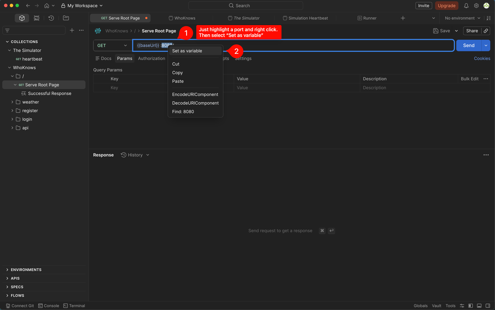

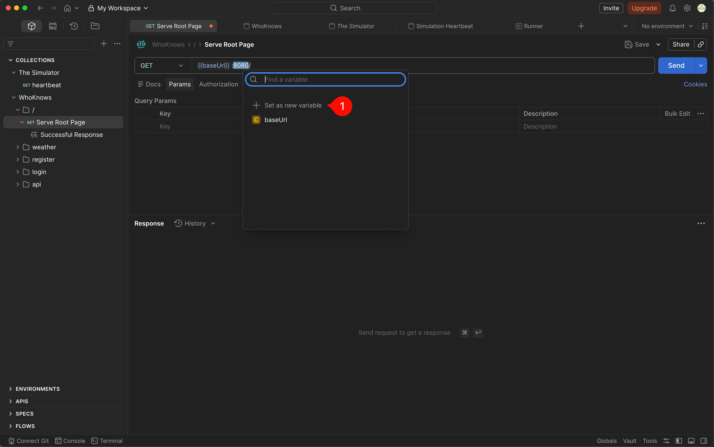

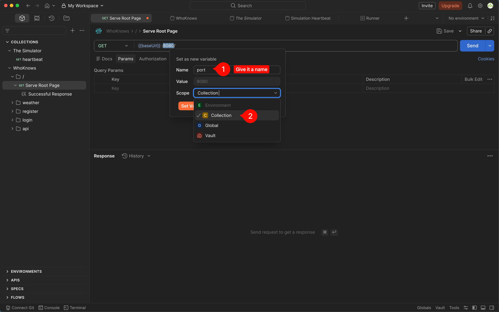


---

## See / edit variables

You can edit variables by clicking on the `...` icon on the upper left side (the collection drawer) and selecting edit.

Choose the `Variables` tab and edit the variables. Change the `BASE_URL` to the deployed server.

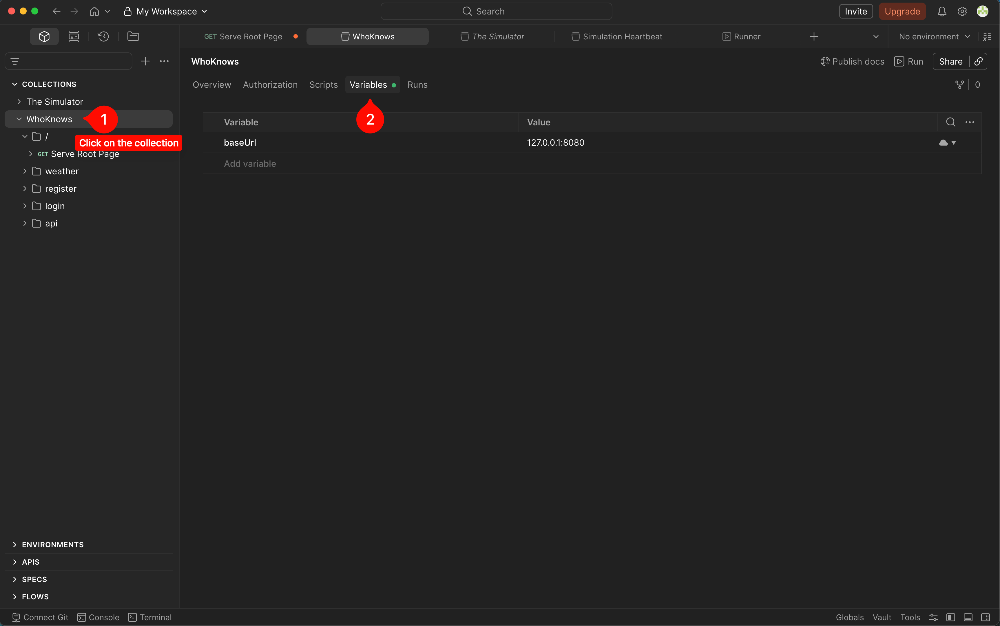

---

## Create tests

On the request page, click on the `Post-response` in the `Scripts` tab:

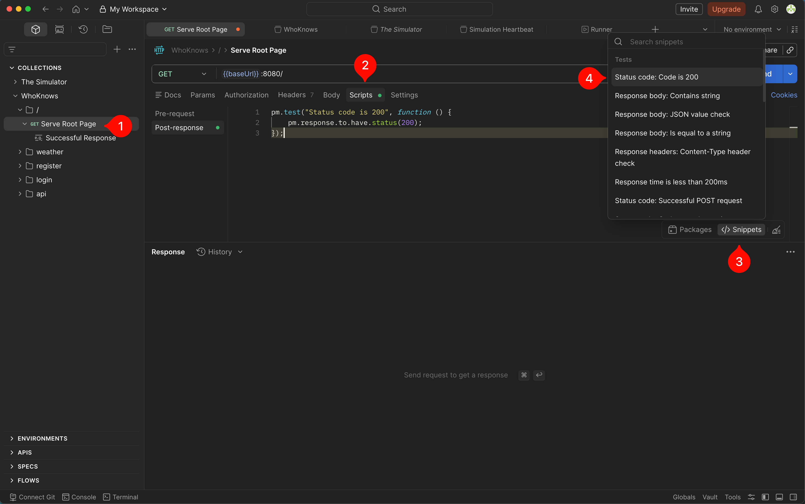

You can optionally watch the API test segment of the video below to learn more:

## [](https://youtu.be/VywxIQ2ZXw4?t=3772)

## Write a test

In the snippets on the right side select `Status code: Code is 200`;

```javascript
pm.test("Status code is 200", function () {
  pm.response.to.have.status(200);
});
```

---

## Run the test

Send the request and select the `Test Result` tab in the lower bottom (the response part).

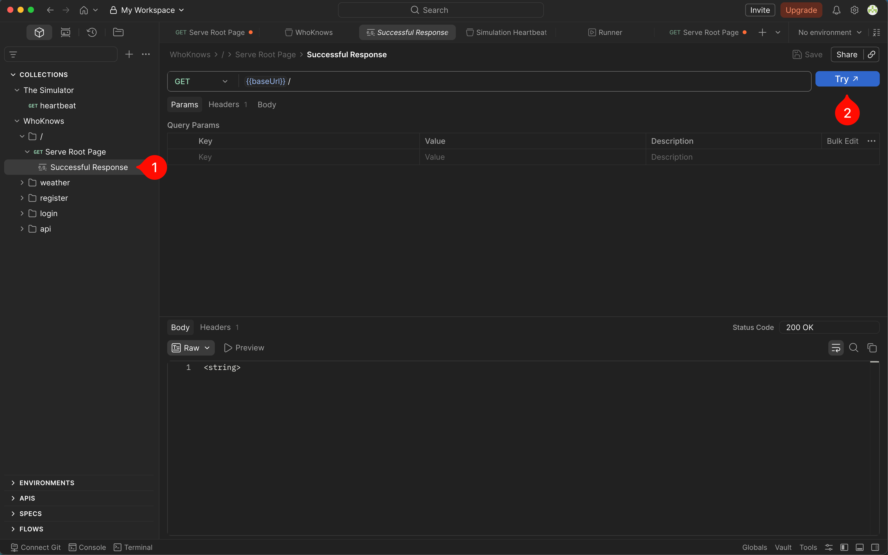

---

## Improve the test

```javascript
pm.test("Status code is 200", function () {
  pm.response.to.have.status(200);
});

pm.test("Response time is less than 200ms", function () {
  pm.expect(pm.response.responseTime).to.be.below(200);
});

pm.test("Response body is present", function () {
  const body = pm.response.json();
  pm.expect(body).to.include("data");
  pm.expect(body.data).to.be.an("array");
});
```


---

# Monitors

---

## Enable Monitors

Click on the icon below `history` in the left side and enable Monitors.

---

## Create a Monitor

Click on `Monitors` on the left side and select `Create a Monitor`:

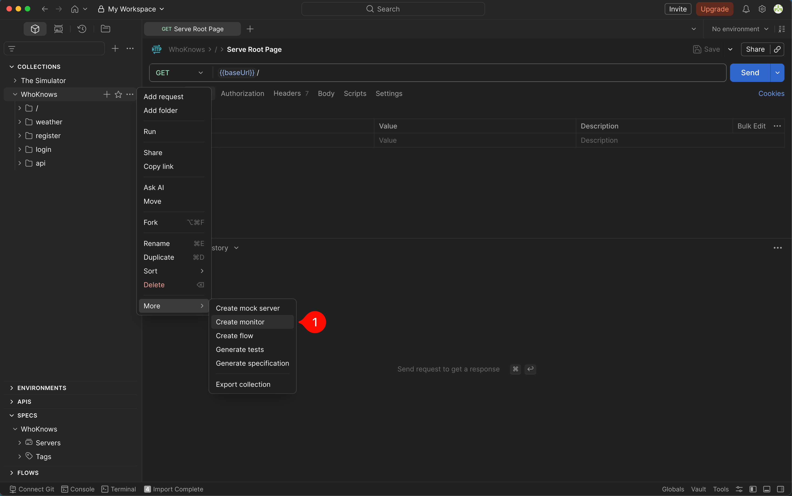

Give it a name and choose  `Hour timer` and `Every hour`. Ensure that other group members will receive emails. 

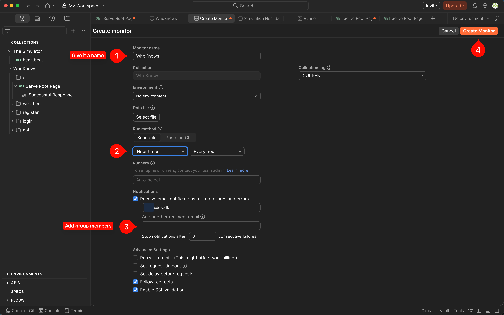

Once you create it, this is the screen you will see. You can try to run it and it will run from Postman Cloud (not your local computer):


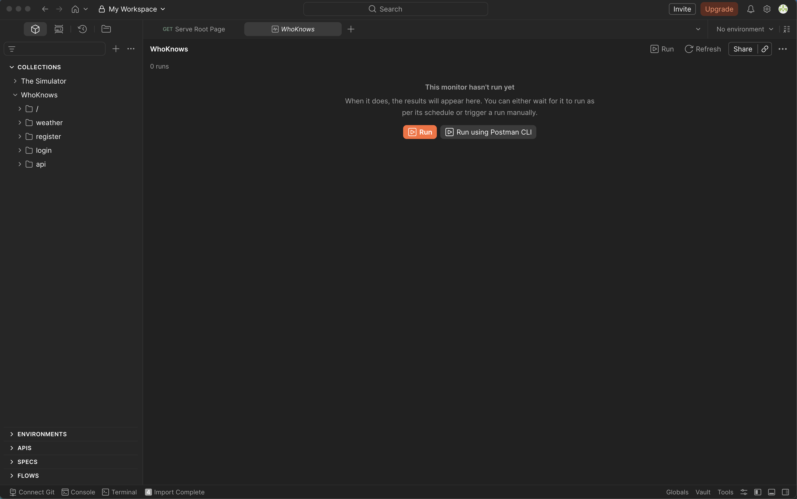

---

## Find the monitor

Here is how you can find the monitor under the collection:

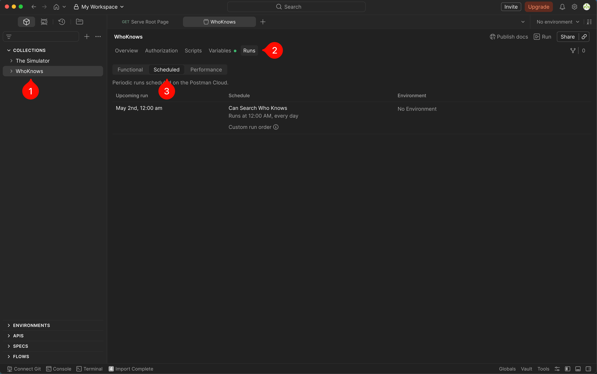

---

## Example monitor

This is what the monitor overview will look like after a multiple succesful runs:

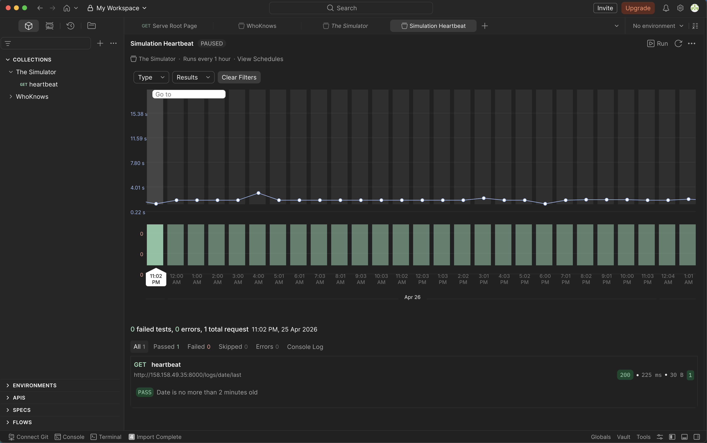

---

## [Optional] Consider creating a team to enable collaboration

https://web.postman.co/purchase?quantity=1&utm_source=postman&utm_medium=app_desktop&utm_term=upgrade&utm_content=navbar

Beware that free teams have an account of up to 3 members.

It is fine not to create a Postman team and just have one person be in charge of the Postman monitoring.

---

## What now?

Now that you have tried to create a monitor for a single test, you can consider writing duplicated tests in `Post-response` for the collection.

https://learning.postman.com/docs/tests-and-scripts/write-scripts/intro-to-scripts/

As an example, if getting a status `200` for all requests is expected then you can put the test as a `Post-response` instead of pasting it onto each endpoint.
